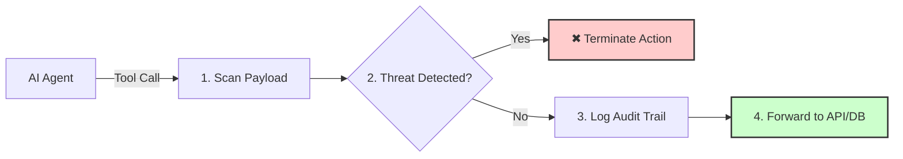

# 🚀 Relay

### A zero-configuration, zero-dependency runtime security proxy for AI agents and MCP tools.

  <a href="https://relay-ai-kappa.vercel.app"><b>Website</b></a> | 
  <a href="https://github.com/aniiketvarshney/Relay.ai.dev/discussions"><b>Community</b></a>

---

## 🛑 What is Relay?

Relay acts as a secure network gateway and execution firewall for autonomous AI agents. Instead of letting an LLM connect directly to your database or APIs, route your traffic through Relay to stop malicious prompt injections from nuking your infrastructure.

### The Execution Loop (Scan ➔ Block ➔ Log ➔ Forward)

