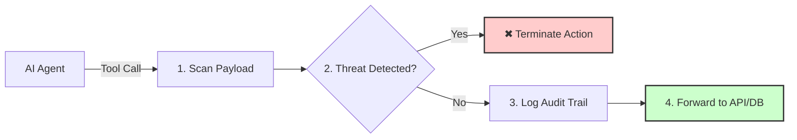

# 🚀 Relay

### A zero-configuration, no external security dependencies runtime security proxy for AI agents and MCP tools.

<p align="center">
  <a href="https://relay-ai-kappa.vercel.app"><b>Website</b></a> | 
  <a href="https://github.com/aniiketvarshney/Relay.ai.dev/discussions"><b>Community</b></a>
</p>

---

## 🛑 What is Relay?

Relay acts as a secure network gateway and execution firewall for autonomous AI agents. Instead of letting an LLM connect directly to your database or APIs, route your traffic through Relay to stop malicious prompt injections from nuking your infrastructure.

### The Execution Loop (Scan ➔ Block ➔ Log ➔ Forward)




## 📊 Audit Logging & Dashboard

Relay now includes full audit logging for small business security:

### Features Added:
- **Complete Audit Trail** - Every tool call, block, and decision is logged
- **Risk Scoring** - Every action gets a risk score (0-100)
- **Audit API** - Available at `/api/audit/logs`
- **Ready for Dashboard** - Easy to build UI to see all logs

### Next (Coming Soon):
- Beautiful Dashboard page
- Search & Filter logs
- Export to CSV
- Real-time alerts


## 🚀 Getting Started

1. Clone & install: `npm install`
2. Copy `.env.example` → `.env.local` and add your Neon DB URL
3. Push schema: `npm run db:push`
4. Run dev server: `npm run dev`

## 📡 API Usage Example

```bash
curl -X POST http://localhost:3000/api/proxy \
  -H "Content-Type: application/json" \
  -d '{"tool":"search_repos","args":{"keyword":"relay"}}'

---

**Made with ❤️ for small business AI agents**
